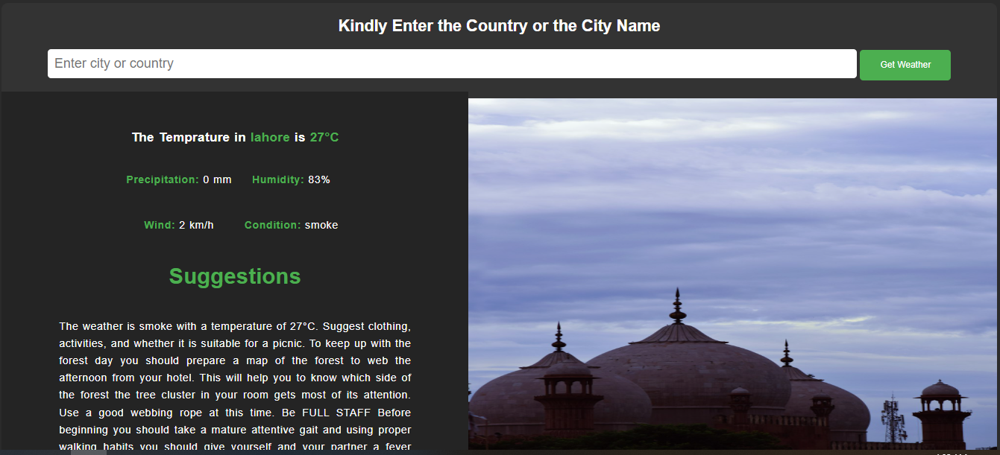

# Weather App 🌤️

A simple web application that displays weather data for a given location. It provides suggestions for activities, clothing, and picnic suitability based on the current weather conditions. The app uses the following APIs:

- **OpenWeatherMap** for real-time weather data.
- **Unsplash** for displaying location images.
- **Hugging Face** for generating suggestions and converting them into speech.

## Features

- Search weather by city or country.
- Displays real-time weather information including:
  - Temperature
  - Precipitation
  - Humidity
  - Wind speed
  - Weather condition
- Automatically fetches relevant images of the location.
- Provides activity and clothing suggestions based on weather conditions.
- Real-time text highlighting synchronized with speech using text-to-speech (TTS) from Hugging Face.

## Demo

- Enter the city or country name in the input field.
- Get the current weather conditions.
- Suggestions based on the weather will be displayed and read out loud.
- Text corresponding to the spoken words changes color in real-time to synchronize with the speech.

## Demo Video

[Download the demo video](demo.mp4)

## Screenshot



## Installation

1. Clone the repository:

   ```bash
   git clone https://github.com/your-username/weather-app.git
   cd weather-app
   ```
